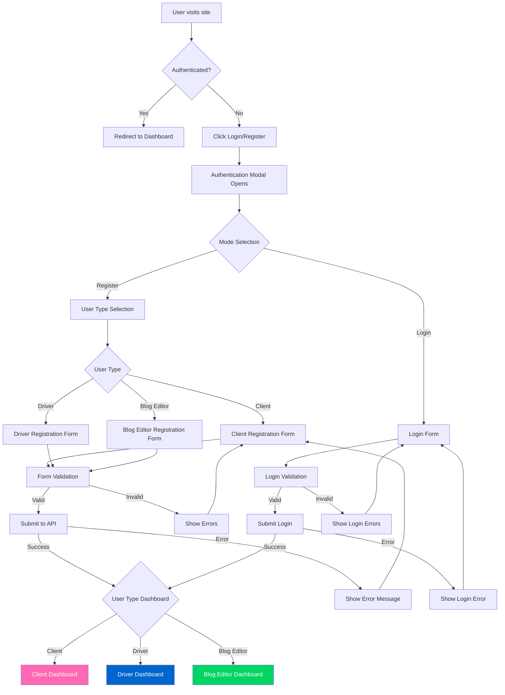
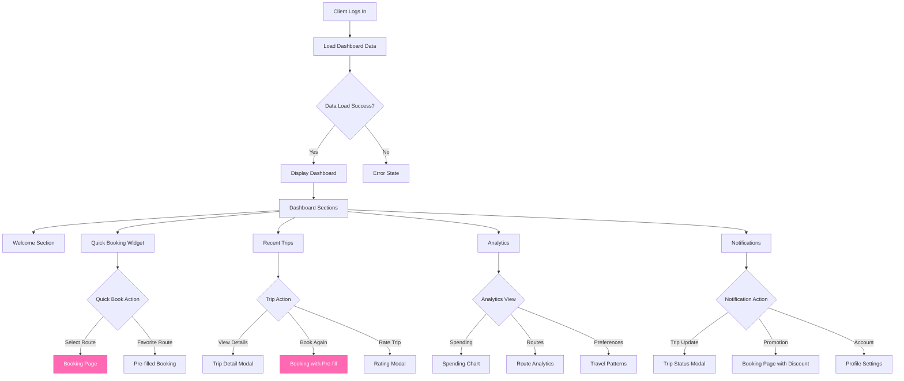
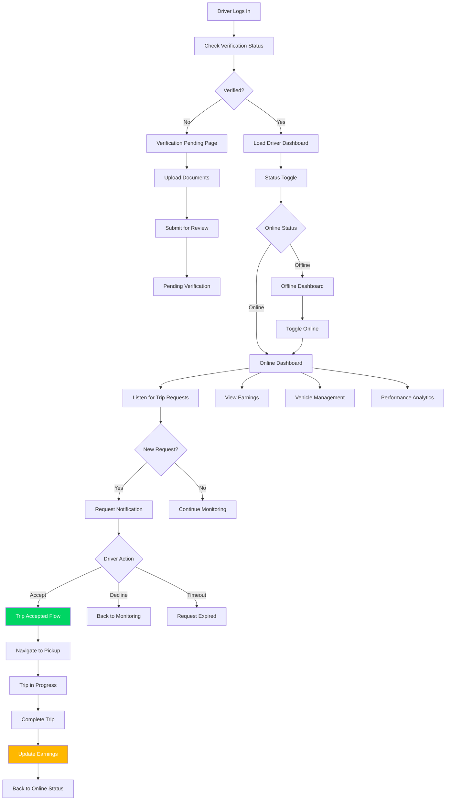
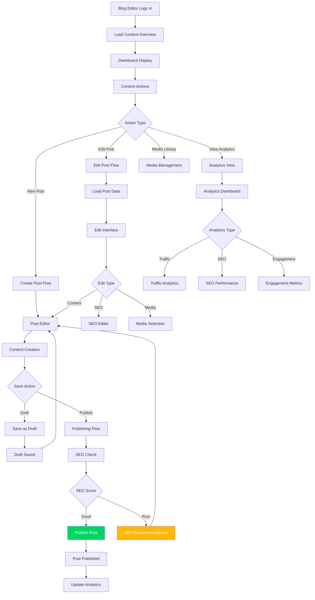
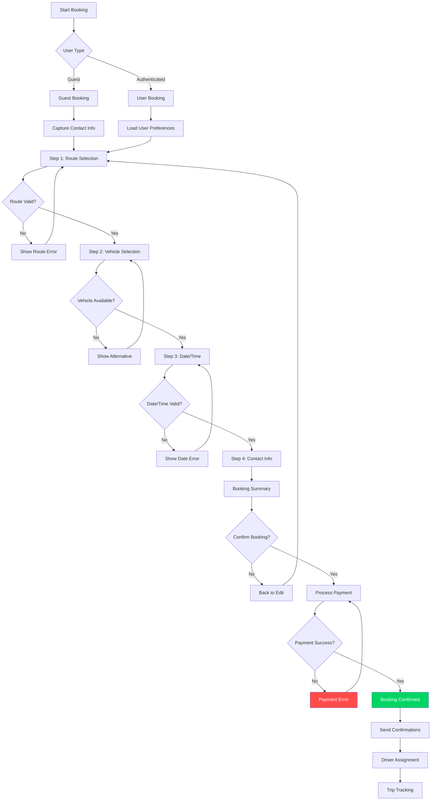
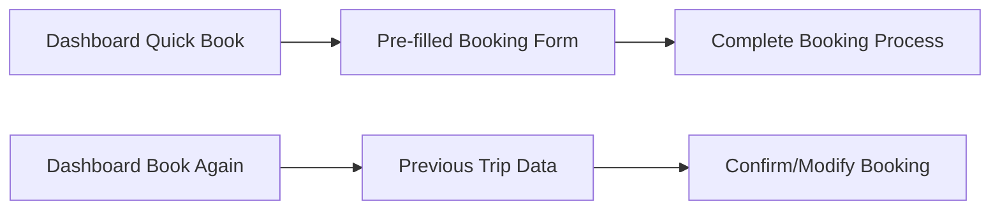
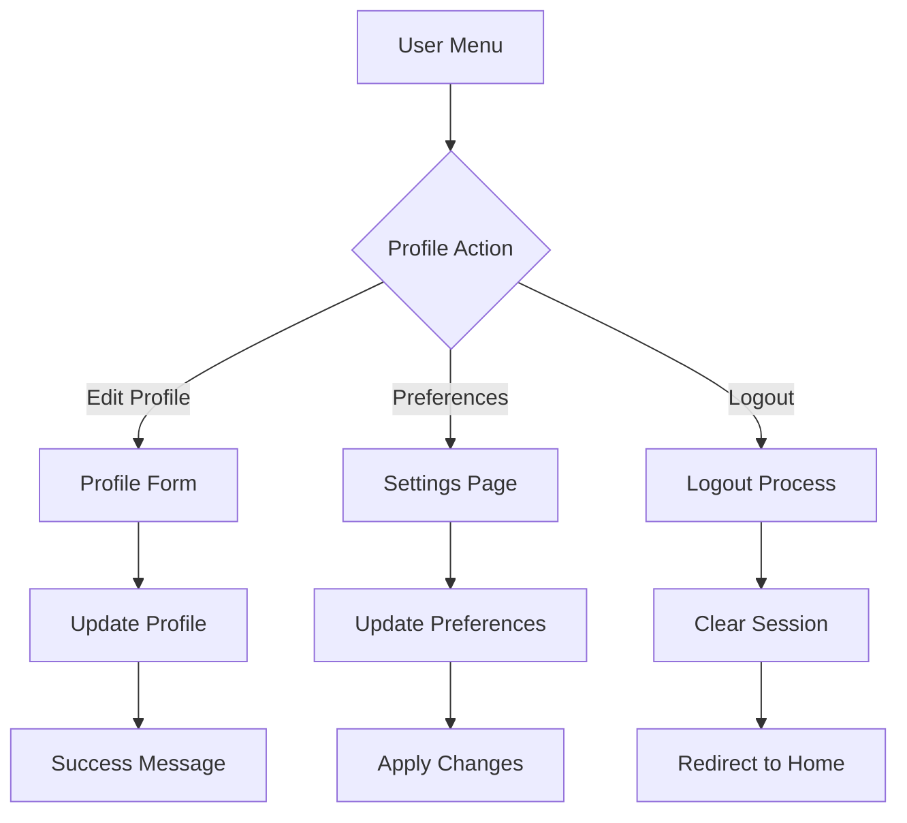
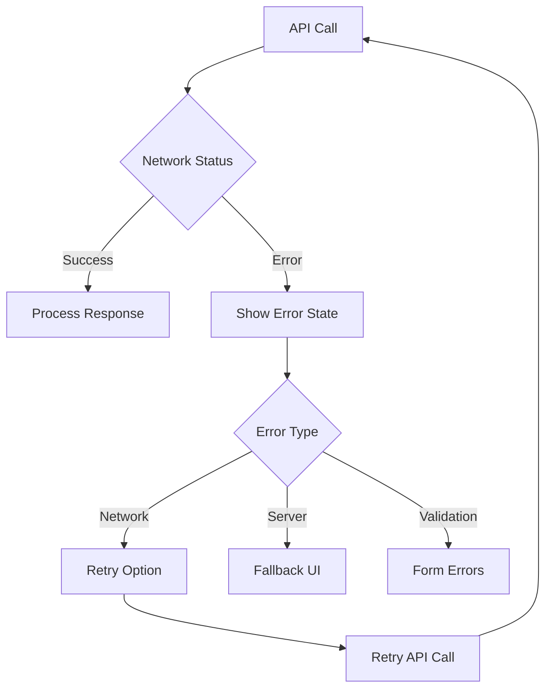
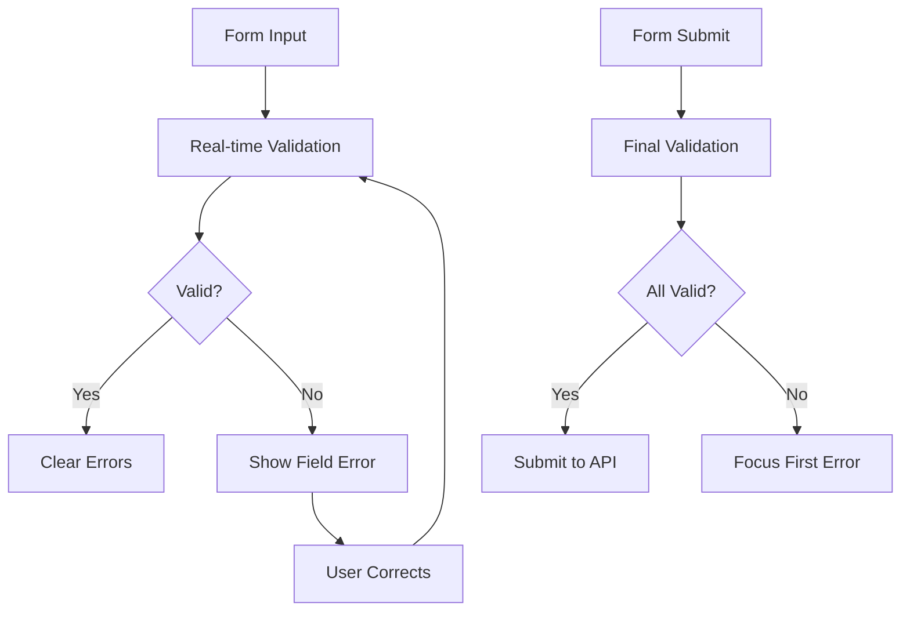

# User Flow Diagrams - Missing Pages

## Overview

This document provides detailed user flow diagrams for the five missing pages in the CrossBorder Vehicle Services application. Each flow includes decision points, error states, and integration points with the existing system.

---

## 1. Authentication & Registration Flow



### Authentication Flow States

#### Initial State
- User lands on any page
- Header shows "Login" and "Book Now" buttons
- Authentication state is checked

#### Login Process
1. **Form Validation**
   - Email format validation
   - Password length requirements
   - Real-time error feedback

2. **API Integration**
   - POST to `/api/auth/login`
   - JWT token stored in HTTP-only cookie
   - User redirected based on role

3. **Error Handling**
   - Invalid credentials
   - Network errors
   - Account verification required

#### Registration Process
1. **User Type Selection**
   - Visual cards for each user type
   - Clear descriptions and benefits
   - Progressive disclosure

2. **Form Completion**
   - Step-by-step process
   - Field validation
   - Password confirmation

3. **Account Creation**
   - API call to `/api/auth/register`
   - Email verification flow
   - Welcome message and onboarding

---

## 2. Client Dashboard Flow



### Client Dashboard Components

#### Data Loading Strategy
```javascript
const DashboardData = {
  welcome: {
    userName: string,
    totalTrips: number,
    totalSpent: number,
    onTimeRate: percentage,
    avgRating: number
  },
  recentTrips: Trip[],
  analytics: {
    monthlySpending: ChartData,
    frequentRoutes: RouteData[],
    preferredVehicles: VehicleStats
  },
  notifications: Notification[],
  quickBooking: {
    favoriteRoutes: Route[],
    lastUsedVehicle: Vehicle,
    savedLocations: Location[]
  }
}
```

#### Real-time Updates
- Trip status notifications
- Booking confirmations
- Price alerts for favorite routes
- Driver location tracking

---

## 3. Driver Dashboard Flow



### Driver Dashboard States

#### Verification Process
1. **Document Upload**
   - Driver's license
   - Vehicle registration
   - Insurance documents
   - Background check

2. **Review Process**
   - Admin verification
   - Status updates
   - Email notifications

#### Online Operations
1. **Request Management**
   - Real-time trip requests
   - Auto-accept preferences
   - Request filtering by distance/price

2. **Trip Execution**
   - GPS navigation integration
   - Customer communication
   - Trip completion flow

---

## 4. Blog Editor Dashboard Flow



### Blog Editor Workflow

#### Content Creation Process
1. **Post Creation**
   - Rich text editor
   - Media embedding
   - SEO optimization
   - Preview mode

2. **Publishing Workflow**
   - Content review
   - SEO validation
   - Publishing schedule
   - Social media integration

#### Content Management
1. **Post Organization**
   - Category management
   - Tag system
   - Search functionality
   - Bulk operations

2. **Performance Tracking**
   - View analytics
   - SEO metrics
   - Engagement tracking
   - Conversion analysis

---

## 5. Booking Flow



### Booking Flow Details

#### Step 1: Route Selection
- **Location Input**
  - Autocomplete functionality
  - Map integration
  - Popular routes suggestions
  - Distance calculation

- **Route Validation**
  - Service area check
  - Border crossing requirements
  - Route optimization

#### Step 2: Vehicle Selection
- **Vehicle Display**
  - Vehicle cards with images
  - Feature comparison
  - Pricing display
  - Availability check

- **Selection Logic**
  - Passenger count validation
  - Luggage requirements
  - Price filtering

#### Step 3: Date & Time
- **Calendar Interface**
  - Available time slots
  - Peak hour pricing
  - Advance booking limits
  - Time zone handling

#### Step 4: Contact & Payment
- **Information Collection**
  - Contact details
  - Special requirements
  - Payment method
  - Terms acceptance

---

## Cross-Page Navigation Flows

### Dashboard to Booking


### Profile Management


---

## Error Handling Flows

### Network Errors


### Form Validation


---

## Integration Points

### API Integration
- **Authentication**: JWT tokens, session management
- **Real-time**: WebSocket connections for live updates
- **Caching**: Redux/Context for state management
- **Offline**: Service worker for offline functionality

### Third-party Services
- **Maps**: Integration with Amap/Google Maps
- **Payments**: Secure payment processing
- **Notifications**: Push notification service
- **Analytics**: User behavior tracking

### State Management
- **Global State**: User authentication, preferences
- **Local State**: Form data, UI states
- **Persistent State**: Offline data, cache
- **Real-time State**: Live trip updates, notifications

This comprehensive user flow documentation ensures that all interactions between the missing pages and the existing system are clearly defined and can be implemented seamlessly by the frontend development team.